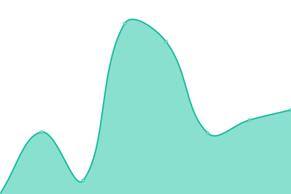
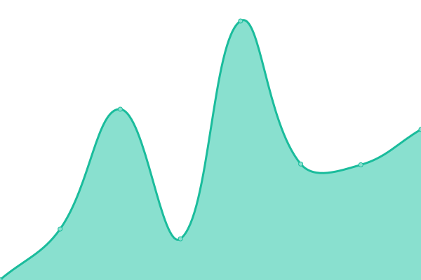
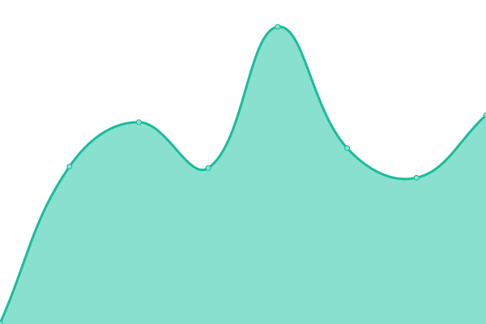

# [📈 Live Status](https://status.iamalex.blue): <!--live status--> **🟩 All systems operational**

This repository contains the open-source uptime monitor and status page for [Upptime](https://upptime.js.org), powered by [Upptime](https://github.com/upptime/upptime).

With [Upptime](https://upptime.js.org), you can get your own unlimited and free uptime monitor and status page, powered entirely by a GitHub repository. We use [Issues](https://github.com/upptime/upptime/issues) as incident reports, [Actions](https://github.com/iamalexblue/siteuptime/actions) as uptime monitors, and [Pages](https://status.iamalex.blue) for the status page.

<!--start: status pages-->
<!-- This summary is generated by Upptime (https://github.com/upptime/upptime) -->
<!-- Do not edit this manually, your changes will be overwritten -->
<!-- prettier-ignore -->
| URL | Status | History | Response Time | Uptime |
| --- | ------ | ------- | ------------- | ------ |
|  [iamalex.blue](https://iamalex.blue) | 🟩 Up | [iamalex-blue.yml](https://github.com/iamalexblue/siteuptime/commits/HEAD/history/iamalex-blue.yml) | 

 2066ms
     
 | 

<a href="https://status.iamalex.blue/history/iamalex-blue">99.31%</a>
    

|  [Music](https://music.iamalex.blue) | 🟩 Up | [music.yml](https://github.com/iamalexblue/siteuptime/commits/HEAD/history/music.yml) | 

 341ms
     
 | 

<a href="https://status.iamalex.blue/history/music">100.00%</a>
    

|  [Onedrive Index](https://drive.iamalex.blue) | 🟩 Up | [onedrive-index.yml](https://github.com/iamalexblue/siteuptime/commits/HEAD/history/onedrive-index.yml) | 

 222ms
     
 | 

<a href="https://status.iamalex.blue/history/onedrive-index">100.00%</a>
    

|  [Notion Page](https://notion.iamalex.blue) | 🟩 Up | [notion-page.yml](https://github.com/iamalexblue/siteuptime/commits/HEAD/history/notion-page.yml) | 

 346ms
     
 | 

<a href="https://status.iamalex.blue/history/notion-page">99.32%</a>
    

|  [Logseq Publish Page](https://congjinyebaiya.wang) | 🟩 Up | [logseq-publish-page.yml](https://github.com/iamalexblue/siteuptime/commits/HEAD/history/logseq-publish-page.yml) | 

 415ms
     
 | 

<a href="https://status.iamalex.blue/history/logseq-publish-page">100.00%</a>
    

<!--end: status pages-->

[**Visit our status website →**](https://status.iamalex.blue)

## 📄 License

- Powered by: [Upptime](https://github.com/upptime/upptime)
- Code: [MIT](./LICENSE) © [Upptime](https://upptime.js.org)
- Data in the `./history` directory: [Open Database License](https://opendatacommons.org/licenses/odbl/1-0/)
