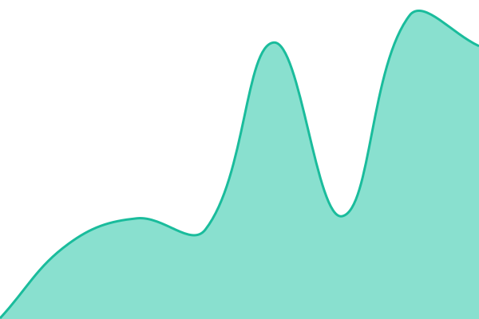
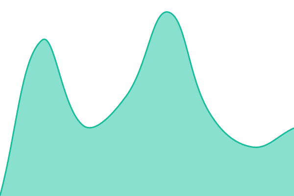
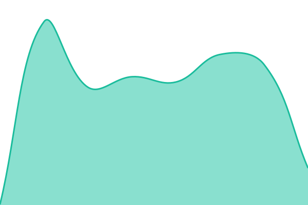
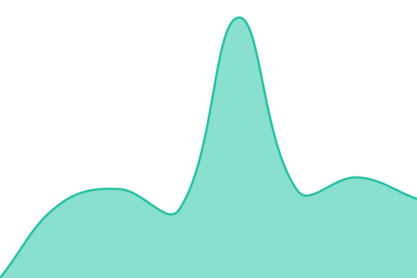

# [📈 Live Status](https://status.iamalex.blue): <!--live status--> **🟧 Partial outage**

This repository contains the open-source uptime monitor and status page for [Upptime](https://upptime.js.org), powered by [Upptime](https://github.com/upptime/upptime).

With [Upptime](https://upptime.js.org), you can get your own unlimited and free uptime monitor and status page, powered entirely by a GitHub repository. We use [Issues](https://github.com/upptime/upptime/issues) as incident reports, [Actions](https://github.com/iamalexblue/siteuptime/actions) as uptime monitors, and [Pages](https://status.iamalex.blue) for the status page.

<!--start: status pages-->
<!-- This summary is generated by Upptime (https://github.com/upptime/upptime) -->
<!-- Do not edit this manually, your changes will be overwritten -->
<!-- prettier-ignore -->
| URL | Status | History | Response Time | Uptime |
| --- | ------ | ------- | ------------- | ------ |
|  [iamalex.blue](https://iamalex.blue) | 🟩 Up | [iamalex-blue.yml](https://github.com/iamalexblue/siteuptime/commits/HEAD/history/iamalex-blue.yml) | 

 384ms
     
 | 

<a href="https://status.iamalex.blue/history/iamalex-blue">100.00%</a>
    

|  [Blue Wonderland](https://ifruit.club) | 🟥 Down | [blue-wonderland.yml](https://github.com/iamalexblue/siteuptime/commits/HEAD/history/blue-wonderland.yml) | 

 49ms
     
 | 

<a href="https://status.iamalex.blue/history/blue-wonderland">100.00%</a>
    

|  [Music](https://music.iamalex.blue) | 🟥 Down | [music.yml](https://github.com/iamalexblue/siteuptime/commits/HEAD/history/music.yml) | 

 0ms
     
 | 

<a href="https://status.iamalex.blue/history/music">100.00%</a>
    

|  [metacubexd](https://d.iamalex.blue) | 🟩 Up | [metacubexd.yml](https://github.com/iamalexblue/siteuptime/commits/HEAD/history/metacubexd.yml) | 

 239ms
     
 | 

<a href="https://status.iamalex.blue/history/metacubexd">100.00%</a>
    

|  [yacd](https://dash.ifruit.club) | 🟥 Down | [yacd.yml](https://github.com/iamalexblue/siteuptime/commits/HEAD/history/yacd.yml) | 

 207ms
     
 | 

<a href="https://status.iamalex.blue/history/yacd">48.54%</a>
    

|  [sing-box-sub](https://sing-box.ifruit.club) | 🟥 Down | [sing-box-sub.yml](https://github.com/iamalexblue/siteuptime/commits/HEAD/history/sing-box-sub.yml) | 

 251ms
     
 | 

<a href="https://status.iamalex.blue/history/sing-box-sub">48.55%</a>
    

|  [Notion blog](https://iamalexblue.notion.site) | 🟩 Up | [notion-blog.yml](https://github.com/iamalexblue/siteuptime/commits/HEAD/history/notion-blog.yml) | 

 112ms
     
 | 

<a href="https://status.iamalex.blue/history/notion-blog">100.00%</a>
    

|  [ChatGPT-Web-Next](https://chat.iamalex.blue) | 🟥 Down | [chat-gpt-web-next.yml](https://github.com/iamalexblue/siteuptime/commits/HEAD/history/chat-gpt-web-next.yml) | 

 0ms
     
 | 

<a href="https://status.iamalex.blue/history/chat-gpt-web-next">100.00%</a>
    

|  [RSS-Hub](https:/rss-hub.iamalex.blue) | 🟥 Down | [rss-hub.yml](https://github.com/iamalexblue/siteuptime/commits/HEAD/history/rss-hub.yml) | 

 396ms
     
 | 

<a href="https://status.iamalex.blue/history/rss-hub">96.60%</a>
    

|  [Koo-Reader](https://reader.iamalex.blue) | 🟩 Up | [koo-reader.yml](https://github.com/iamalexblue/siteuptime/commits/HEAD/history/koo-reader.yml) | 

 221ms
     
 | 

<a href="https://status.iamalex.blue/history/koo-reader">100.00%</a>
    

|  [Status](https://status.iamalex.blue) | 🟥 Down | [status.yml](https://github.com/iamalexblue/siteuptime/commits/HEAD/history/status.yml) | 

 1147ms
     
 | 

<a href="https://status.iamalex.blue/history/status">47.84%</a>
    

<!--end: status pages-->

[**Visit our status website →**](https://status.iamalex.blue)

## 📄 License

- Powered by: [Upptime](https://github.com/upptime/upptime)
- Code: [MIT](./LICENSE) © [Upptime](https://upptime.js.org)
- Data in the `./history` directory: [Open Database License](https://opendatacommons.org/licenses/odbl/1-0/)
